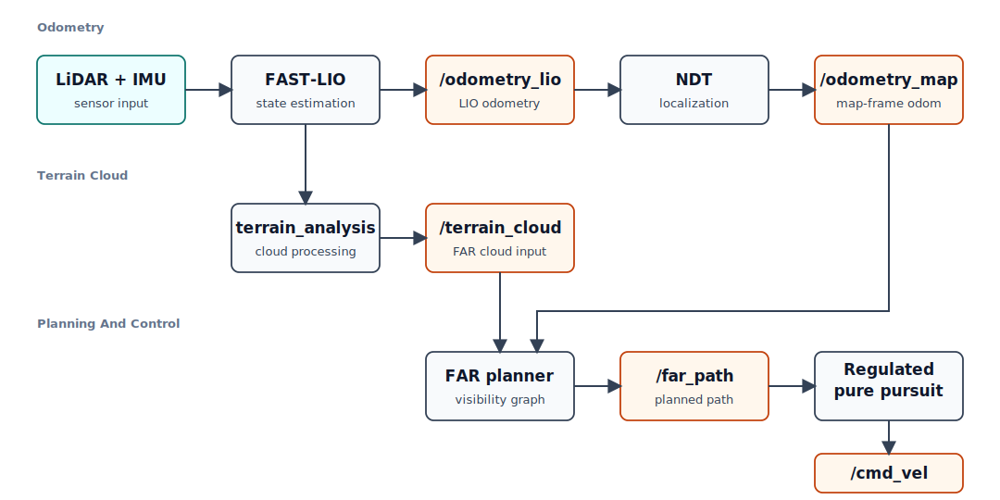

# Spot Edge Navigation

ROS 2 Humble workspace for running the Spot navigation stack from an onboard
host machine, with remote monitoring over Zenoh.

The current field workflow is centered around `tmux_session.sh`. It prepares
separate panes for the robot driver, sensors, localization, planning, route
management, Zenoh, and bag recording. Most commands are prefilled so the
operator can review them before pressing Enter.

## System Overview



Robot-specific launch files, maps, and configs live in `src/spot_navigation`.
`fast_lio`, `terrain_analysis`, `ndt_localization`, `far_planner`, and
`mpl_planner` are used as implementation packages. The active FAST-LIO and
terrain cloud configuration for this workflow is
`src/spot_navigation/config/lio_localization.yaml`.

## Repository Layout

```text
.
|-- Dockerfile
|-- docker-compose.yml
|-- docker-compose.nvidia.yml
|-- tmux_session.sh
|-- zenoh_host.sh
|-- zenoh_client.sh
|-- radio_receiver.py
|-- radio_sender.py
`-- src/
    |-- spot_navigation/    # Robot launch files, configs, maps, route manager
    |-- fast_lio/           # LiDAR-inertial odometry executable
    |-- ndt_localization/   # NDT map-frame localization
    |-- terrain_analysis/   # Map and terrain cloud processing
    |-- far_planner/        # Visibility-graph planner
    |-- mpl_planner/        # Pure pursuit controller
    |-- spot_ros2_driver/   # Spot ROS 2 driver
    `-- velodyne/           # Velodyne driver packages
```

## Runtime Options

This workspace can run either natively on Ubuntu 22.04 with ROS 2 Humble, or
inside the provided Docker container.

Use native execution when the robot host or remote laptop already has Ubuntu
22.04, ROS 2 Humble, and the required dependencies installed. Use Docker when
the machine is not Ubuntu 22.04, does not have ROS 2 Humble installed, or you
want a reproducible environment.

## Build

### Native Ubuntu 22.04 / ROS 2 Humble

From the repo root:

```bash
source /opt/ros/humble/setup.bash
colcon build --symlink-install --cmake-args -DCMAKE_BUILD_TYPE=Release
source install/setup.bash
```

Native installs need `pyserial` available as `serial` for the radio scripts and
serial IMU driver:

```bash
sudo apt install python3-serial
```

### Docker

Build and start the container from the repo root. The default Compose file does
not require an NVIDIA GPU:

```bash
docker compose up -d --build
docker compose exec ros-humble-dev bash
```

On a machine with an NVIDIA GPU and the NVIDIA container runtime installed, use
the NVIDIA overlay:

```bash
docker compose -f docker-compose.yml -f docker-compose.nvidia.yml up -d --build
docker compose exec ros-humble-dev bash
```

Inside the container:

```bash
source /opt/ros/humble/setup.bash
colcon build --symlink-install --cmake-args -DCMAKE_BUILD_TYPE=Release
source install/setup.bash
```

The image includes `python3-serial` so `radio_receiver.py`,
`radio_sender.py`, the radio bridge, and the serial IMU driver can import
`serial`.

## Robot Host Workflow

Use this flow from a remote laptop that SSHes into the robot host machine:

```bash
ssh spot@<robot-host-ip>
cd /home/spot/spot_ws
```

Then enter either the native ROS environment or the Docker container.

Native:

```bash
source /opt/ros/humble/setup.bash
source install/setup.bash
```

Docker:

```bash
docker compose up -d
docker compose exec ros-humble-dev bash
```

Inside the container:

```bash
source /opt/ros/humble/setup.bash
source install/setup.bash
```

Start the field session:

```bash
export BOSDYN_CLIENT_PASSWORD='<spot-password>'
./tmux_session.sh
```

The tmux session creates three windows:

```text
hardware
  pane 0: Spot driver command
  pane 1: sensor drivers, IMU, OWON, radio bridge
  pane 2: spare

software
  pane 0: LIO localization commands
  pane 1: FAR planner commands
  pane 2: route manager command

topics
  pane 0: Zenoh router command
  pane 1: rosbag recorder command
  pane 2: spare
```

Start the Zenoh router first from the `topics` window. For remote monitoring,
replace the prefilled `./zenoh_host.sh` command with:

```bash
./zenoh_host.sh remote
```

Then start the robot driver, sensors, localization, planner, and route manager
from their panes. The prefilled default workflow uses the microgrid prior map:

```bash
ros2 launch spot_navigation lio_localization.launch.py map_path:=.../microgrid_transformed.pcd
ros2 launch spot_navigation far_planner.launch.py use_sim_time:=false load_prior_map:=true prior_map_path:=.../microgrid_transformed.vgh
ros2 run spot_navigation route_manager --ros-args -p route_name:=midpoint
```

The localization and planner panes also keep the office prior-map and no-prior
SLAM variants in shell history.

The bag recorder pane uses ROS 2's default timestamped bag name and splits bag
files at 1 GiB:

```bash
ros2 bag record -a --max-bag-size 1073741824
```

## Remote Visualization

Run this on the remote laptop, not inside the SSH session to the robot host.
The laptop needs the repo checkout and network access to the robot host. It may
use either native ROS 2 Humble or the Docker container.

Native:

```bash
cd /path/to/spot_ws
source /opt/ros/humble/setup.bash
source install/setup.bash
source zenoh_client.sh
rviz2
```

Docker:

```bash
xhost +local:docker
cd /path/to/spot_ws
docker compose up -d --build
docker compose exec ros-humble-dev bash
```

If the laptop has an NVIDIA GPU and the NVIDIA container runtime installed,
start the container with the NVIDIA overlay instead:

```bash
xhost +local:docker
cd /path/to/spot_ws
docker compose -f docker-compose.yml -f docker-compose.nvidia.yml up -d --build
docker compose exec ros-humble-dev bash
```

Inside the remote laptop container:

```bash
source /opt/ros/humble/setup.bash
source install/setup.bash
source zenoh_client.sh
rviz2
```

`zenoh_client.sh` currently connects to:

```bash
tcp/192.168.80.100:7447
```

If the robot host uses a different IP address, edit `zenoh_client.sh` and
change the endpoint before sourcing it.

For Docker RViz, `xhost +local:docker` must be run on the laptop host terminal,
not inside the container, before starting or entering the container.

To revoke that X11 access later:

```bash
xhost -local:docker
```

## Radio Receiver

`radio_receiver.py` can be run on the machine connected to the receiving radio.
Run it from the active runtime environment:

```bash
python3 radio_receiver.py --port /dev/ttyUSB0 --baud 57600
```

Use the actual serial device path for the receiver. Native setups need access
to the serial device and `python3-serial` installed. The Docker container runs
privileged through `docker-compose.yml`, so USB serial devices should be visible
inside the container.

## Persistent Serial Device Names

The robot host uses udev symlinks so IMU and radio device names do not depend on
`ttyUSB` ordering:

```text
/dev/imu_usb
/dev/radio_usb
```

Rules are stored at:

```text
src/spot_navigation/config/99-spot-serial.rules
```

Install them on the robot host:

```bash
sudo install -m 0644 src/spot_navigation/config/99-spot-serial.rules /etc/udev/rules.d/99-spot-serial.rules
sudo udevadm control --reload-rules
sudo udevadm trigger
ls -l /dev/imu_usb /dev/radio_usb
```

## IMU Reconfiguration After Reboot

The WIT IMU currently needs to be reconfigured after each robot host reboot,
before starting the sensor drivers. This appears to be a device or vendor
settings-persistence limitation, but the permanent-save behavior has not been
fully investigated yet.

The configuration script opens `/dev/imu_usb` at the default baud rate, sets the
IMU output rate to 100 Hz, switches the IMU baud rate to 115200, and sends the
save command:

```bash
python3 src/wit_ros2_imu/configure_imu.py
```

Run it from the active robot host runtime environment after `/dev/imu_usb`
exists and before launching the sensor drivers. The default sensor launch uses
the persistent `/dev/imu_usb` and `/dev/radio_usb` symlinks:

```bash
ros2 launch spot_navigation sensors.launch.py radio_baud:=57600
```

## Direct Launch Commands

The tmux workflow is preferred, but the same stack can be launched manually
inside the active robot host runtime environment. Start Zenoh before the other
ROS nodes because `zenoh_host.sh` intentionally stops existing ROS processes
before launching the router.

```bash
export RMW_IMPLEMENTATION=rmw_zenoh_cpp
source /opt/ros/humble/setup.bash
source install/setup.bash
```

Terminal 1:

```bash
./zenoh_host.sh remote
```

Terminal 2:

```bash
ros2 launch spot_navigation sensors.launch.py radio_baud:=57600
```

Terminal 3:

```bash
ros2 launch spot_navigation lio_localization.launch.py
```

Terminal 4:

```bash
ros2 launch spot_navigation far_planner.launch.py use_sim_time:=false load_prior_map:=true
```

Terminal 5:

```bash
ros2 run spot_navigation route_manager --ros-args -p route_name:=midpoint
```
