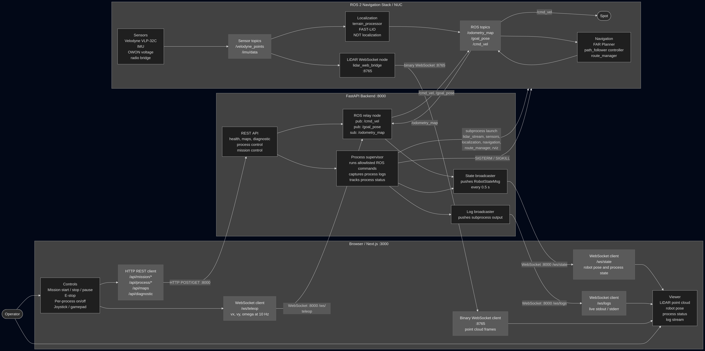

# Spot Edge Navigation

ROS 2 Humble workspace for running the Spot navigation stack from an onboard
NUC, with a browser UI for process control, mission control, telemetry, logs,
teleop, and live LiDAR viewing.

The system is split into three main layers:

- Web UI: Next.js app on `http://<robot-host>:3000`
- Backend: FastAPI control plane on `http://<robot-host>:8000`
- ROS 2 ecosystem: Spot driver, sensors, localization, planning, route
  management, and a LiDAR WebSocket stream on `ws://<robot-host>:8765`

## System Overview



The web UI talks to the backend over REST and WebSockets. The backend launches
allowlisted ROS processes, bridges teleop and goal commands into ROS topics,
and streams process status and logs back to the browser. The LiDAR point-cloud
viewer connects directly to the `lidar_web_bridge` node on port `8765`.

## Repository Layout

```text
.
|-- web/                  # Next.js browser UI
|-- backend/              # FastAPI backend and ROS bridge
|-- docs/                 # Architecture diagrams
|-- tmux_session.sh       # Optional field-session terminal layout
|-- zenoh_host.sh         # Robot-side Zenoh router helper
|-- zenoh_client.sh       # Remote ROS/RViz Zenoh client helper
`-- src/
    |-- spot_navigation/  # Launch files, configs, maps, route manager
    |-- lidar_web_bridge/ # Binary point-cloud WebSocket stream
    |-- fast_lio/         # LiDAR-inertial odometry
    |-- ndt_localization/ # Map-frame localization
    |-- terrain_analysis/ # Global/terrain cloud processing
    |-- far_planner/      # Visibility-graph planner
    |-- path_follower/    # Regulated pure-pursuit controller
    |-- spot_ros2_driver/ # Spot ROS 2 driver
    `-- velodyne/         # Velodyne driver packages
```

## Build

Native Ubuntu 22.04 / ROS 2 Humble:

```bash
source /opt/ros/humble/setup.bash
colcon build --symlink-install --cmake-args -DCMAKE_BUILD_TYPE=Release
source install/setup.bash
```

Install backend and web dependencies:

```bash
cd backend
pip install -r requirements.txt

cd ../web
npm install
```

Native installs need `python3-serial` for the radio scripts and serial IMU
driver:

```bash
sudo apt install python3-serial
```

Docker is also supported for ROS development:

```bash
docker compose up -d --build
docker compose exec ros-humble-dev bash
```

Use the NVIDIA overlay only on machines with the NVIDIA container runtime:

```bash
docker compose -f docker-compose.yml -f docker-compose.nvidia.yml up -d --build
docker compose exec ros-humble-dev bash
```

## Run On The Robot Host

Start from the built workspace on the robot computer:

```bash
cd /path/to/ros2_ws
source /opt/ros/humble/setup.bash
source install/setup.bash
export RMW_IMPLEMENTATION=rmw_zenoh_cpp
export BOSDYN_CLIENT_PASSWORD='<spot-password>'
```

Start Zenoh first:

```bash
./zenoh_host.sh remote
```

Start the backend:

```bash
cd backend
./dev_run.sh
```

Start the web UI:

```bash
cd web
npm run dev
```

Open the UI from a browser:

```text
http://<robot-host>:3000
```

From the UI, start the ROS processes as needed:

- `lidar_stream`: serves live point-cloud frames on `:8765`
- `sensors`: Velodyne, IMU, OWON voltage, radio bridge, static transforms
- `localization`: terrain processing, FAST-LIO, NDT map localization
- `navigation`: FAR Planner and `path_follower`
- `route_manager`: publishes route waypoints to `/goal_pose`
- `rviz`: optional local RViz process

`tmux_session.sh` remains available as a terminal-based field workflow when you
want prefilled panes for Zenoh, Spot driver, sensors, localization, planning,
route management, and bag recording.

## Web Interface

The browser UI provides:

- Process start/stop controls for allowlisted ROS commands
- Mission start, stop, pause, resume, home, and E-stop actions
- Keyboard/gamepad teleop over `/ws/teleop`
- Robot state over `/ws/state`, including `/odometry_map`, multimeter
  voltage, and process status
- Live process logs over `/ws/logs`
- Three.js point-cloud rendering from `ws://<robot-host>:8765`

The backend publishes `/cmd_vel` and `/goal_pose`, subscribes to
`/odometry_map` and `owon/value`, and supervises subprocesses for
`lidar_stream`, `sensors`, `localization`, `navigation`, `route_manager`, and
`rviz`.

Backend API details live in `backend/README.md`.

## Manual ROS Launches

The web UI is the preferred operator path, but the stack can be launched
manually after sourcing ROS and the workspace:

```bash
export RMW_IMPLEMENTATION=rmw_zenoh_cpp
source /opt/ros/humble/setup.bash
source install/setup.bash
```

```bash
./zenoh_host.sh remote
ros2 launch spot_navigation sensors.launch.py radio_baud:=57600
ros2 launch spot_navigation lidar_stream.launch.py
ros2 launch spot_navigation lio_localization.launch.py
ros2 launch spot_navigation far_planner.launch.py use_sim_time:=false load_prior_map:=true
ros2 run spot_navigation route_manager --ros-args -p route_name:=midpoint
```

Record a field bag when needed:

```bash
ros2 bag record -a --max-bag-size 1073741824
```

## Operational Notes

- The workspace uses `rmw_zenoh_cpp`; start the Zenoh router before nodes that
  need to communicate across machines.
- The robot host uses persistent serial symlinks `/dev/imu_usb` and
  `/dev/radio_usb`; rules are in
  `src/spot_navigation/config/99-spot-serial.rules`.
- After a robot host reboot, reconfigure the WIT IMU before launching sensors:
  `python3 src/wit_ros2_imu/configure_imu.py`.
- The web backend currently has open CORS and no authentication. Treat
  `:3000`, `:8000`, and `:8765` as trusted lab-LAN services only.
- For UI development off the robot (no ROS 2 / hardware available), set
  `MOCK_VOLTAGE=1` when starting the backend to generate a synthetic voltage
  reading in place of the real `owon/value` subscription. It only activates
  when rclpy isn't available, so it's a no-op on the robot host.
